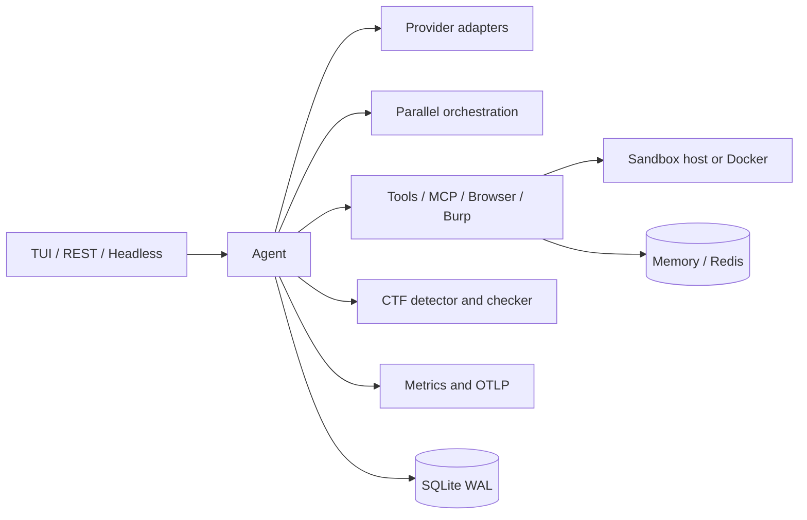

# Architecture

WROSECODE is one Rust binary with four presentation surfaces: the differential terminal dashboard, headless execution, ACP, and an Axum REST/web server. All surfaces call the same `Agent` runtime.

Provider secrets stay outside sessions. SQLite stores session payloads, tool metadata, flags, and classified errors. JSON session files remain supported for portability. Provider calls, independent tools, and delegated agents use bounded concurrency.

The headless and CLI surfaces are thin wrappers over the same runtime: a prompt
plus `--summary json` prints a `TaskComplete` object, `--until`/`--until-cmd`/
`--goal` decide the exit code (unmet contract exits 2), and `ctfd verify` maps a
platform verdict onto shell-friendly exit codes (0/2/1). Integration tests in
`tests/` exercise those paths against local mock HTTP servers.

The TUI builds a complete frame but the renderer compares it with the prior frame and writes changed rows only. Mouse resizing changes the horizontal split without clearing the terminal.

Terminal control is decided once per run by `TerminalProfile` (see `src/tui.rs`):
a pure `decide` function takes the configured alternate-screen flag, the
`mouse_capture` setting, and a `TerminalEnv` snapshot of the process environment,
then returns whether to take the alternate screen, capture the mouse, and repaint
every frame. Dumb terminals get neither alternate screen nor mouse, VS Code keeps
its native wheel, and Zellij forces a full repaint. `TerminalGuard::enter` only
emits the escape sequences the profile asked for, and its `Drop` matches, so the
terminal is always restored to exactly the state it started in.

Metrics are a separate hot-path object shared as `Arc`: every provider response
and tool call records into counters, per-model totals, and a fixed-bucket
latency histogram (`HISTOGRAM_BOUNDS`). `Metrics::snapshot` exposes them for the
dashboard; `Metrics::export` writes `metrics.json`, `metrics.csv`, and
`latency.csv`.

`shell` calls go through one `sandbox` module. With `[sandbox] engine = "none"`
(the default) it runs `run_with_timeout` on the host; with `engine = "docker"` it
reuses a single persistent container bind-mounted at `/workspace`, so a command
costs one `docker exec` instead of a container start. If docker, the daemon, or
the image is missing the tool call fails with instructions rather than quietly
dropping back to the host.
