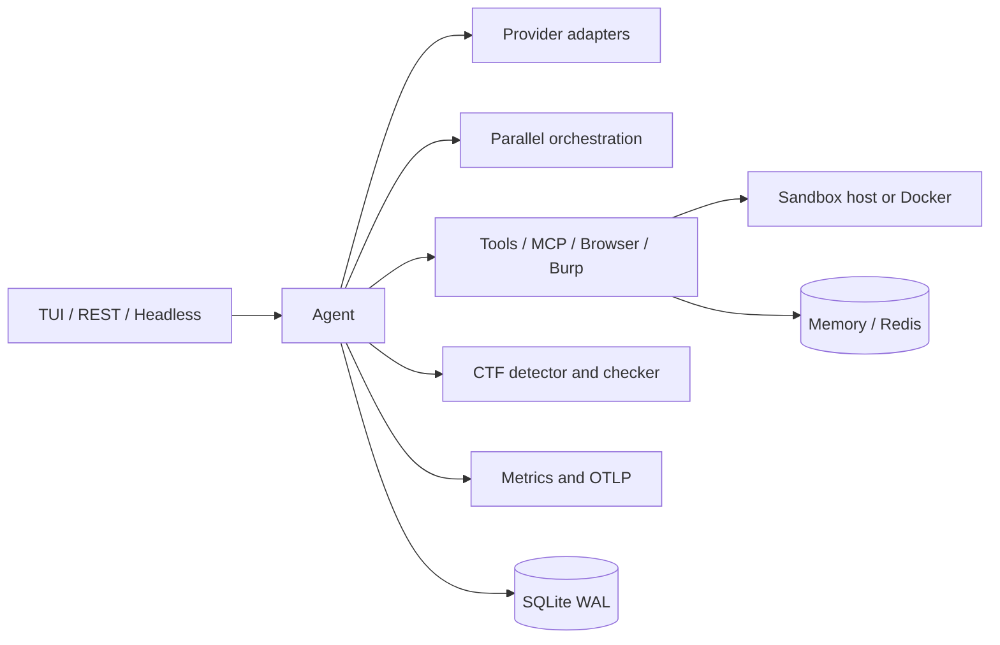

# Architecture

WROSECODE is one Rust binary with four presentation surfaces: the differential terminal dashboard, headless execution, ACP, and an Axum REST/web server. All surfaces call the same `Agent` runtime.

Provider secrets stay outside sessions. SQLite stores session payloads, tool metadata, flags, and classified errors. JSON session files remain supported for portability. Provider calls, independent tools, and delegated agents use bounded concurrency.

The headless and CLI surfaces are thin wrappers over the same runtime: a prompt
plus `--summary json` prints a `TaskComplete` object, `--until`/`--until-cmd`/
`--goal` decide the exit code (unmet contract exits 2), and `ctfd verify` maps a
platform verdict onto shell-friendly exit codes (0/2/1). Integration tests in
`tests/` exercise those paths against local mock HTTP servers.

The TUI builds a complete frame but the renderer compares it with the prior frame and writes changed rows only, clearing any rows a shrinking frame leaves behind. Mouse resizing changes the horizontal split without clearing the terminal.

Frame layout is `Ui::compose(width, height)`, a pure function split out of
rendering: it returns the rows and caret position and is what the unit tests
assert on (including exact output at 10x4, 23x7, and 80x24). Scrollback is
virtualized — the transcript is wrapped once into `transcript_lines`, keyed by
content and pane width, and scrolling reslices that cache instead of
re-wrapping, so a long history costs nothing per frame. `PageUp`/`PageDown`
page by the real viewport height, `Home`/`End` jump the transcript when the
input is empty, the header reports `· ↓ N new lines  (End to jump)` whenever
the view is not following the bottom (each line pushed while detached feeds
the count until `End`), and `/clear` drops the transcript while keeping the
conversation context. `Ctrl+L` clears the visible transcript and redraws;
only `/clear --context` also drops conversation context.

Input is never dropped while a model turn is running: keys land in the input
box, `Enter` queues the message for after the reply (the status line shows
`queued N`), and `Ctrl+C` cancels only that turn by truncating the messages the
turn appended. `tests/e2e_tui.rs` drives all of this through a real PTY
(`script` from util-linux) and skips itself where that helper is unavailable.

Terminal control is decided once per run by `TerminalProfile` (see `src/tui.rs`):
a pure `decide` function takes the configured alternate-screen flag, the
`mouse_capture` setting, and a `TerminalEnv` snapshot of the process environment,
then returns whether to take the alternate screen, capture the mouse, and repaint
every frame. Dumb terminals get neither alternate screen nor mouse, VS Code keeps
its native wheel, and Zellij forces a full repaint. `TerminalGuard::enter` only
emits the escape sequences the profile asked for, and its `Drop` matches, so the
terminal is always restored to exactly the state it started in.

Startup order is deliberate: `main` records the boot `Instant` as its first
action, builds the `Config`, and then — only when the run will show the TUI —
takes the terminal with `TerminalGuard::enter` and paints the splash from
`src/splash.rs` *before* provider setup, skill discovery, metrics, MCP
reconnects, and session restore, so the first frame never waits on disk or
network. `splash::paint` stamps the measured time into a `OnceLock`; the frame
stamps it back onto the top row (`· paint 9ms`), `/debug` reports it as
`First paint` against the 50 ms budget (`FIRST_PAINT_BUDGET_MS`, pinned by a
unit test), and `tests/e2e_tui.rs` proves from a real PTY that the stamp lands
in the first bytes the process writes — the splash is the first frame, and
provider/MCP/skill init never sit in front of it.

Colour is decided once per process: `TerminalProfile::decide` maps `NO_COLOR`
(or `--no-color`), `TERM`, and `COLORTERM` to a `ColorSupport` of `None`,
`Ansi16`, `Ansi256`, or `TrueColor`, which drives both the splash's wordmark
gradient (`gradient_paint` embeds SGR per character, degrading to a single
accent wrap on Ansi16 and plain text on `None`; below 80 columns the art
collapses to one `WROSECODE v…` line) and the compose path's per-character
`Row::colors` gradient. Under `None` compose swaps in `PLAIN_THEME`, so frames
emit no colour codes at all.

Themes are one `const THEMES` list in `src/tui.rs` — dark, light, solarized,
dracula, nord, mono — plus `USER_THEMES` loaded once from
`~/.wrosecode/themes/*.toml` (`parse_theme` requires five hex colours and skips
bad hex, unparsable files, or a shadow of a built-in name) at the top of
`tui::run`, before `Ui::new` so `config.toml` can already name a user palette.
`theme(index)` wraps over built-ins then user palettes, `theme_index` keeps
legacy names like `wrose-dark` resolving to dark, `theme_position` answers
`Ctrl+T` and `/theme NAME`, and `theme_names` feeds the picker and the
unknown-theme list, so a palette cannot drift from the registry.

While the transcript is empty, `compose` renders the start screen: the gradient
wordmark (session, category, speed tier, paint stamp), an info panel with
provider/model, thinking and resource budget, sandbox and approval, working
directory, mode, harness, git branch, and MCP and skill counts, then provider
health with a `/providers` hint, a rotating tip advanced from the spinner tick,
three recent sessions with one-line `resume` suggestions, and a `/ctf` hint.
After the first message it collapses to a one-line `WROSECODE v…` header. The
bottom status line leads with the run state, model, `think:` level, tokens,
cache hit rate, elapsed seconds, and the per-turn tool step, then sandbox,
tier, workers, cost, and tool counts — front-loaded so the fields that matter
survive clipping on narrow terminals.

Metrics are a separate hot-path object shared as `Arc`: every provider response
and tool call records into counters, per-model totals, and a fixed-bucket
latency histogram (`HISTOGRAM_BOUNDS`). `Metrics::snapshot` exposes them for the
dashboard; `Metrics::export` writes `metrics.json`, `metrics.csv`, and
`latency.csv`.

`shell` calls go through one `sandbox` module. With `[sandbox] engine = "none"`
(the default) it runs `run_with_timeout` on the host; with `engine = "docker"` it
reuses a single persistent container bind-mounted at `/workspace`, so a command
costs one `docker exec` instead of a container start. If docker, the daemon, or
the image is missing the tool call fails with instructions rather than quietly
dropping back to the host.
